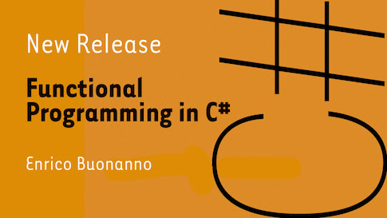

# Functional Programming in C# #

This repo contains the code samples, exercises and solutions for the book
[Functional Programming in C#](https://www.manning.com/books/functional-programming-in-c-sharp?a_aid=functional-programming-in-c-sharp&a_bid=ad9af506)
published by Manning.

[](https://www.manning.com/books/functional-programming-in-c-sharp?a_aid=functional-programming-in-c-sharp&a_bid=ad9af506)

The code samples are organized in the following projects:

- **Examples**: examples used throughout the book, by chapter
- **Exercises**: placeholders for you to do the exercises, compile and run them;
  and compare to the provided solutions
- **LaYumba.Functional**: a functional library that we develop throughout the book
- **LaYumba.Functional.Data**: very simple functional data structures discussed in Chapter 9
- **LaYumba.Functional.Tests**: also illustrative of topics explained in the book, and
  useful to better understand the constructs in the library
- **Boc.Domain**: an example of using F# for domain objects

**Note:** you are welcome to reference `LaYumba.Functional` from your projects
via [NuGet](https://www.nuget.org/packages/LaYumba.Functional), and submit
PRs with improvements, but the main intent of this library is pedagogical.
For a more fully-fledged functional library, consider [LanguageExt](https://github.com/louthy/language-ext)

## Working with the code samples

The code samples use .NET Standard 1.6 and .NET Core 2.0, and should compile and run on all major OS's
via the `dotnet` CLI.

### Prerequisites

- [.NET Core 2.0.3 SDK](https://www.microsoft.com/net/download/core)

To check this is available, type `dotnet --version` at the command prompt, and you should get `2.0.3` or greater

### One-time setup

```
$ git clone git@github.com:la-yumba/functional-csharp-code.git
$ cd functional-csharp-code
$ dotnet restore
```

### Running the tests

Use the `dotnet test` command, for example:

```
$ cd LaYumba.Functional.Tests
$ dotnet test
```

tests in the `Exercises` and `Examples` projects can be run in the same way.

### Running examples

Many code samples in the book can be run, in case you'd like to debug or "see that it works".
The pattern is:

```
$ cd Examples
$ dotnet run Greetings
```

| Section | Command
|---:| ---
| 7.1 | `dotnet run Greetings`

## Setting up the REPL

Throughout the book, I encourage readers to try things out in the [REPL](https://en.wikipedia.org/wiki/Read%E2%80%93eval%E2%80%93print_loop).

- If you use Visual Studio, you can start the REPL by going to
`View > Other Windows > C# Interactive` (short tutorial [here](https://github.com/dotnet/roslyn/wiki/C%23-Interactive-Walkthrough))
- On Mono, use the `csharp` command
- There are several other REPLs available, some even run in the browser

You'll often need to import `LaYumba.Functional` in the REPL. In C# Interactive,
this can be done like so:

```csharp
#r "functional-csharp-code\LaYumba.Functional\bin\Debug\netstandard1.6\LaYumba.Functional.dll"
```

The path above may not work for you, in which case use an absolute path to the dll,
or type `Directory.GetCurrentDirectory()` into the REPL to see what to use as a base for a relative path.

Next, add these imports:

```csharp
using LaYumba.Functional;
using static LaYumba.Functional.F;
```

You're now ready to experiment with functional code right in the REPL, for example:

```csharp
> Func<int, int, int> plus = (a, b) => a + b;
> Some(plus).Apply(1).Apply(2)
[Some(3)]
> Some(plus).Apply(1).Apply(None)
[None]
```

## Doing the exercises

- edit the code in `Exercises` as needed
- edit `Exercises/Program.cs` to start the class you want
- run it with:

  ```
  $ cd Exercises
  $ dotnet run
  ```
- run your tests:

  ```
  $ cd Exercises
  $ dotnet test
  ```
